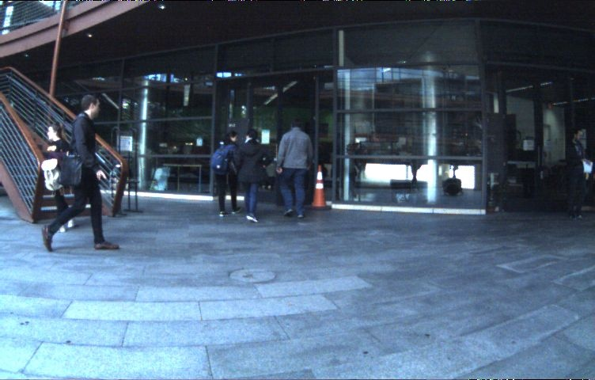
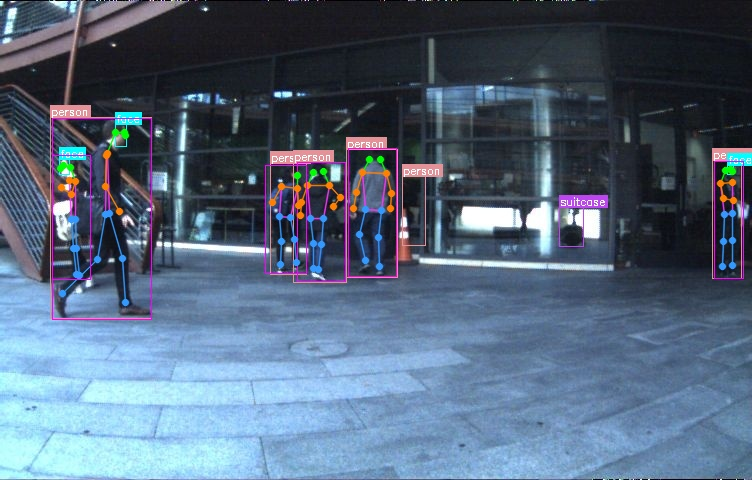
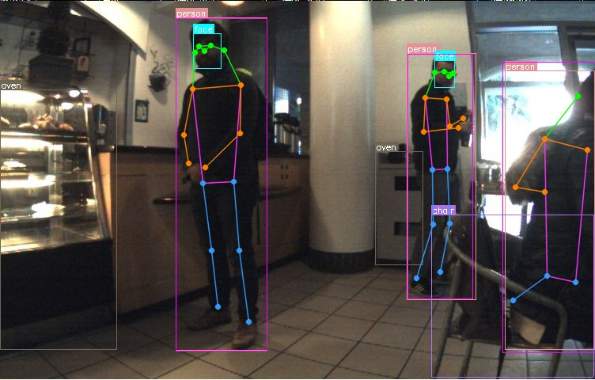
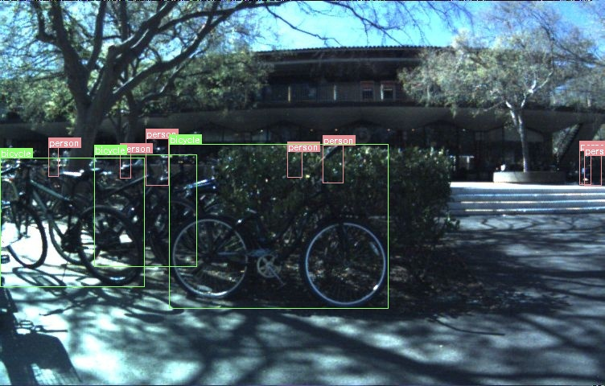

# JRDB Toolkit

Config-driven pipeline for processing the JRDB 2022 dataset into YOLO-format training data with detection, pose, and face annotations.

## Directory Structure

```
jrdb_toolkit/
├── run.py                      # Single entry point
├── requirements.txt
├── config/
│   └── config.yaml             # Master configuration (all paths, models, task settings)
├── tasks/
│   ├── convert_labels.py       # Stage 1:  JRDB JSON -> YOLO txt
│   ├── generate_images.py      # Stage 2:  Flatten JRDB images to YOLO layout
│   ├── sample_dataset.py       # Stage 3:  Subsample every Nth frame
│   ├── merge_coco_labels.py    # Stage 4:  COCO inference + merge with person labels
│   ├── filter_occluded.py      # Stage 5:  Remove occluded person boxes
│   ├── inference_face.py       # Stage 6:  Face inference (class 80)
│   ├── inference_pose.py       # Stage 7:  Pose inference (17 keypoints)
│   ├── format_dataset.py       # Stage 8:  Organize into train dataset structure
│   ├── visualize.py            # Stage 9:  Visualize detection/pose/both
│   ├── generate_videos.py      # Stage 10: Generate annotated MP4 videos
│   └── analyze.py              # Stage 11: Overlap statistics
└── utils/
    ├── drawing.py              # Shared drawing (COCO_CLASSES, colors, draw_box, skeleton)
    └── yolo.py                 # Shared YOLO parsing (parse_yolo_label, is_contained)
```

## Dataset Download

This toolkit requires the **JRDB 2022** dataset. The dataset is not publicly available for direct download - you must apply for access first:

1. Visit the official JRDB website: https://jrdb.erc.monash.edu/
2. Register an account and submit an access request
3. Once approved, download the dataset and extract it to a local directory
4. Update `GLOBAL.DATASET_ROOT` in `config/config.yaml` to point to your extracted dataset path

The expected dataset structure under `DATASET_ROOT` is:

```
JRDB_2022/
└── train/
    ├── images/
    │   ├── image_0/          # Camera views (27 scenes each)
    │   ├── image_2/
    │   ├── image_4/
    │   ├── image_6/
    │   ├── image_8/
    │   └── image_stitched/
    └── labels/
        ├── labels_2d/        # 2D detection labels (JSON)
        ├── labels_2d_pose_coco/  # 2D pose labels in COCO format (JSON)
        └── labels_2d_head/   # Head/face labels in COCO format (JSON)
```

## Setup

### Requirements

- Python 3.8+
- NVIDIA GPU with CUDA (for inference stages 4, 6, 7, 10)

### Install dependencies

```bash
pip install -r requirements.txt
```

### Models

Download or place the following model files:

| Model | Config Key | Used By |
|-------|-----------|---------|
| YOLO11x (COCO 80-class) | `MODELS.DETECTION` | Stage 4 (merge_coco_labels), Stage 10 (generate_videos) |
| YOLO11l-face | `MODELS.FACE` | Stage 6 (inference_face), Stage 10 (generate_videos) |
| YOLO11x-pose | `MODELS.POSE` | Stage 7 (inference_pose), Stage 10 (generate_videos) |

Set the paths in `config/config.yaml` under `MODELS`. Relative paths are resolved against `DATASET_ROOT`.

## Usage

All commands are run from the `jrdb_toolkit/` directory.

### Run all enabled tasks

```bash
python run.py
```

Runs every task with `ENABLED: true` in order of `ORDER` value.

### Run a single task

```bash
python run.py --task <task_name>
```

This ignores the `ENABLED` flag and runs the specified task directly. Task names are lowercase:

```bash
python run.py --task convert_labels      # Stage 1
python run.py --task generate_images     # Stage 2
python run.py --task sample_dataset      # Stage 3
python run.py --task merge_coco_labels   # Stage 4
python run.py --task filter_occluded     # Stage 5
python run.py --task inference_face      # Stage 6
python run.py --task inference_pose      # Stage 7
python run.py --task format_dataset      # Stage 8
python run.py --task visualize           # Stage 9
python run.py --task generate_videos     # Stage 10
python run.py --task analyze             # Stage 11
```

### Use a custom config

```bash
python run.py --config /path/to/custom.yaml
```

## Sample Results

### Raw JRDB Image


### Detection + Pose Overlay


### More Examples
| Bytes-cafe scene | Tressider scene (crowded) |
|:---:|:---:|
|  |  |

### Video Demo (Cubberly Auditorium)

<video src="assets/sample_video.mp4" controls width="752">
  Video: assets/sample_video.mp4
</video>

## Pipeline Stages

### Stage 1: Convert Labels

Converts JRDB JSON labels into YOLO `.txt` format for three label types:
- **Detection**: person bounding boxes from `labels_2d/`
- **Pose**: person keypoints (17 COCO joints) from `labels_2d_pose_coco/`
- **Face**: head bounding boxes from `labels_2d_head/`

### Stage 2: Generate Images

Flattens the JRDB multi-camera directory structure (`image_0/`, `image_2/`, ...) into a single flat directory with filenames matching the YOLO labels (e.g. `image_2_scene_name_000003.jpg`).

### Stage 3: Sample Dataset

Subsamples every Nth frame per video sequence to create a smaller dataset. Creates `_every{N}` copies of images and all label directories.

### Stage 4: Merge COCO Labels

Runs COCO 80-class detection inference on sampled images and merges non-person predictions (classes 1-79) with the original person-only labels (class 0).

### Stage 5: Filter Occluded

Removes detection boxes that are mostly contained inside a larger person box (e.g. a backpack box fully inside a person box). Controlled by `CONTAINMENT_THRESHOLD`.

### Stage 6: Inference Face

Runs face detection model and appends face detections as class 80 to the filtered labels.

### Stage 7: Inference Pose

Runs pose estimation model and saves YOLO pose labels with bounding box + 17 keypoints per person.

### Stage 8: Format Dataset

Organizes all processed files into a training dataset directory structure:

```
{OUTPUT_DIR}/
└── {SPLIT}/
    ├── images/                  <- sampled YOLO images
    ├── labels/
    │   ├── detection/           <- final detection labels (COCO 80 + face, filtered)
    │   └── pose/
    │       └── points/          <- inferred pose labels
    └── labels-GT/
        ├── detection/           <- ground truth person-only detection labels
        └── pose/
            └── points/          <- ground truth pose labels from JRDB
```

### Stage 9: Visualize

Draws detection boxes and/or pose skeletons on images for visual inspection. Supports three modes: `detection`, `pose`, or `both`.

### Stage 10: Generate Videos

Generates annotated MP4 videos with all overlays (person boxes, COCO detections, face, pose skeleton). Runs all three models live on full (non-sampled) images.

### Stage 11: Analyze

Prints overlap statistics: how many boxes are contained inside person boxes, class pair counts, person box size distribution.

## Configuration

All settings are in `config/config.yaml`. Every line is commented with a description.

### Key settings

| Setting | Description |
|---------|-------------|
| `GLOBAL.DATASET_ROOT` | Root directory of the JRDB 2022 dataset |
| `GLOBAL.SAMPLE_EVERY` | Keep every Nth frame (e.g. 20 = 1/20th of frames) |
| `GLOBAL.DEVICE` | CUDA device ID (e.g. `"0"` for first GPU) |
| `GLOBAL.BATCH_SIZE` | Default batch size for inference |
| `GLOBAL.CONF_THRESHOLD` | Default confidence threshold for predictions |

### Enable/disable tasks

Set `ENABLED: true` or `ENABLED: false` for each task in the `TASKS` section. The `ORDER` field controls execution order when running all enabled tasks.

### Example: run only stages 1-3

```yaml
TASKS:
  CONVERT_LABELS:
    ENABLED: true
    ORDER: 1
  GENERATE_IMAGES:
    ENABLED: true
    ORDER: 2
  SAMPLE_DATASET:
    ENABLED: true
    ORDER: 3
  MERGE_COCO_LABELS:
    ENABLED: false    # skip
    ORDER: 4
  # ... set remaining tasks to ENABLED: false
```

Then run:

```bash
python run.py
```

## Output Directories

After a full pipeline run, the following directories are created under `DATASET_ROOT`:

| Directory | Created By | Contents |
|-----------|-----------|----------|
| `results/yolo_detection_labels/` | Stage 1 | Person-only YOLO detection labels |
| `results/yolo_pose_labels/` | Stage 1 | YOLO pose labels (GT) |
| `results/yolo_face_labels/` | Stage 1 | YOLO face/head labels (GT) |
| `results/yolo_images/` | Stage 2 | Flat YOLO-format images |
| `results/yolo_images_every20/` | Stage 3 | Sampled images |
| `results/yolo_detection_labels_every20/` | Stage 3 | Sampled detection labels |
| `results/yolo_detection_labels_every20_coco80/` | Stage 4 | Merged with COCO predictions |
| `results/yolo_detection_labels_every20_coco80_filtered/` | Stage 5 | After removing occluded boxes |
| `results/yolo_detection_labels_every20_coco80_filtered_with_face/` | Stage 6 | With face detections added |
| `results/yolo_pose_labels_every20/` | Stage 7 | Inferred pose labels |
| `jrdb_train_dataset/train/` | Stage 8 | Formatted training dataset |
